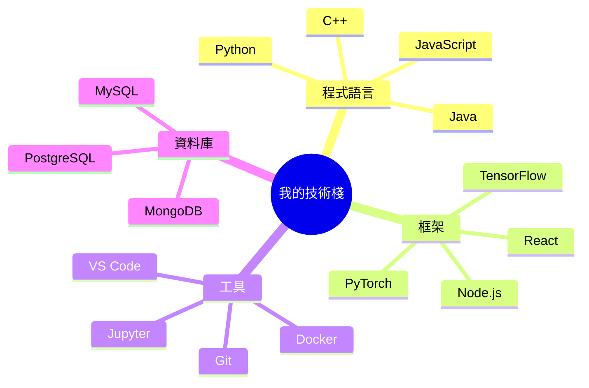

NYUST AI


<div align="center">
  
# 👋 歡迎來到 lzt0104 的程式宇宙 🌌

[](https://git.io/typing-svg)


</div>

## 🚀 關於我

> *"程式碼就像幽默。當你必須解釋它時，它就不好笑了。"* – Cory House

哈囉！我是一位熱愛程式設計和人工智慧的愛好者，目前就讀於國立雲林科技大學（雲科大）。我的程式旅程橫跨各種語言和框架，特別專注於開發能夠產生影響力的智慧型應用程式。

- 🎓 目前在雲科大攻讀學位
- 🔭 正在進行令人興奮的 AI 專案
- 🌱 不斷學習新技術
- 💡 將創意轉化為優雅的程式碼
- 🎯 目標：為創新的 AI 解決方案做出貢獻

## 💻 技術棧

<div align="center">
  


</div>

## 📊 GitHub 統計

<div align="center">
  
  
  
  
  
  
  
</div>

## 🌟 精選專案

<div align="center">

| 專案 | 描述 | 技術棧 |
|---------|-------------|------------|
| 🤖 AI 助手 | 具有自然語言處理的智慧型對話代理 | Python, TensorFlow, NLP |
| 🌐 個人作品集 | 展示我的作品和技能的響應式網站 | React, Three.js, Tailwind CSS |
| 📱 行動應用程式 | 具有流暢 UI 的跨平台應用程式 | React Native, Firebase |
| 🎮 遊戲開發 | 具有絢麗視覺效果的互動式 2D 平台遊戲 | Unity, C# |

</div>

## 📈 編程之旅

```
         ⭐                  🚀     ⭐    
              ✨                 ⭐        
  🌱  ✨              🔥                  
起點 -------- 學習階段 ------- 專案開發 ----> 未來
  |             |                  |
  |             |                  |
第一行        精通各種            建立
程式碼        程式語言            作品集       
```

## 🎵 目前正在聆聽

<div align="center">
  
[](https://open.spotify.com/user/user_id)

</div>

## 🤝 與我聯繫

<div align="center">
  
[](https://linkedin.com/in/username)
[](https://twitter.com/username)
[](https://instagram.com/username)
[](https://youtube.com/channel/channel_id)

</div>

## 👁️ 個人檔案瀏覽次數

<div align="center">
  


</div>

---

<div align="center">
  
⭐ 由 [lzt0104](https://github.com/lzt0104) 用 ❤️ 製作


</div>
